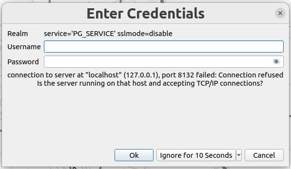
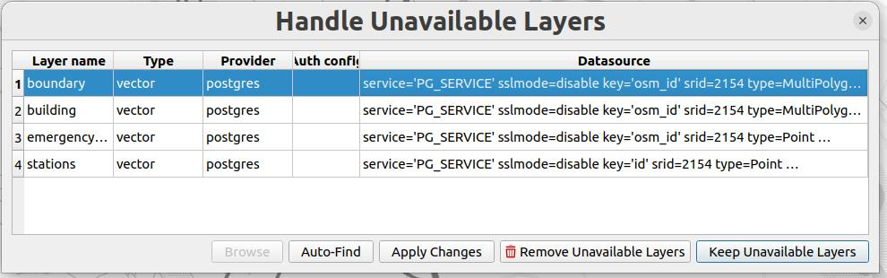
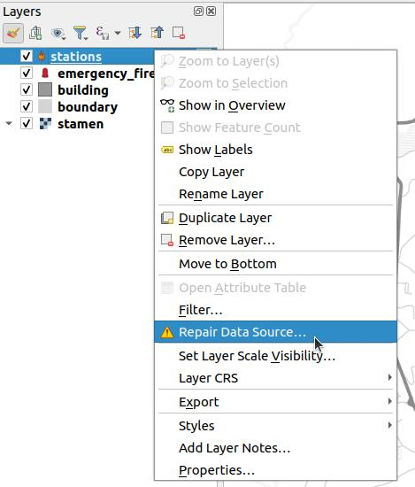

# Installation

The ZIP downloaded from [demo server](https://demo.lizmap.com) contains everything inside.

## SQL data

Some projects are using SQL data. By default, projects are using a
[PostgreSQL service](https://www.postgresql.org/docs/current/libpq-pgservice.html) called `PG_SERVICE`.

1. You should first have a look at the content of the SQL file, to see for instance the associated SQL schema it will
**overwrite**.

2. Load the SQL in your database

At this step, there are two options :

   1. Either to have a service called `PG_SERVICE`  according to the [PostgreSQL documentation](https://www.postgresql.org/docs/current/libpq-pgservice.html)
      and similar to an [existing one in LWC](https://github.com/3liz/lizmap-web-client/blob/master/tests/docker-conf/pg_service.conf).
      The most difficult part is to know where you can put this file according to your system or to define `PGSERVICEFILE` in QGIS desktop.
   2. Open the QGS project

Or : 

   1. Open the QGS project
   2. Press "Ignore for 10 seconds"
      
   3. **Either** edit the datasource manually, according to your imported data, **or** press again "Keep unavailable layers"
      
   4. On an unavailable layer, do this to repair the datasource :
       
   5. Pick the layer you have imported in your database
