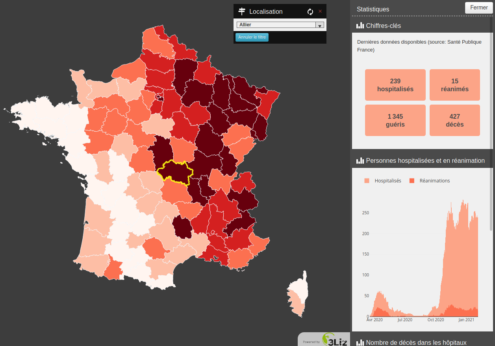

# Covid demo

Available on https://demo.lizmap.com

This demo shows the dataviz feature for Covid data in France.
You can use the combobox in the upper right corner of the map to filter data for a specific area.
The dataviz is following the chosen area.
You can reset the filter with the blue button
