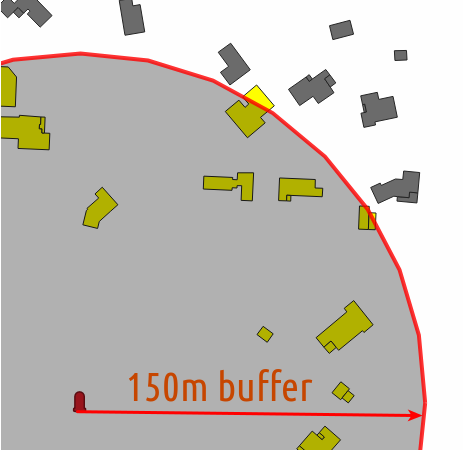

# Actions

* Click on a fire hydrant and
  * select buildings which are within 150 meters.
  * find the closest fire station.

[Online demo](https://demo.lizmap.com/lizmap/index.php/view/map?repository=features&project=fire_hydrant_actions)

Please check the [documentation](https://docs.lizmap.com) about how to build actions.
