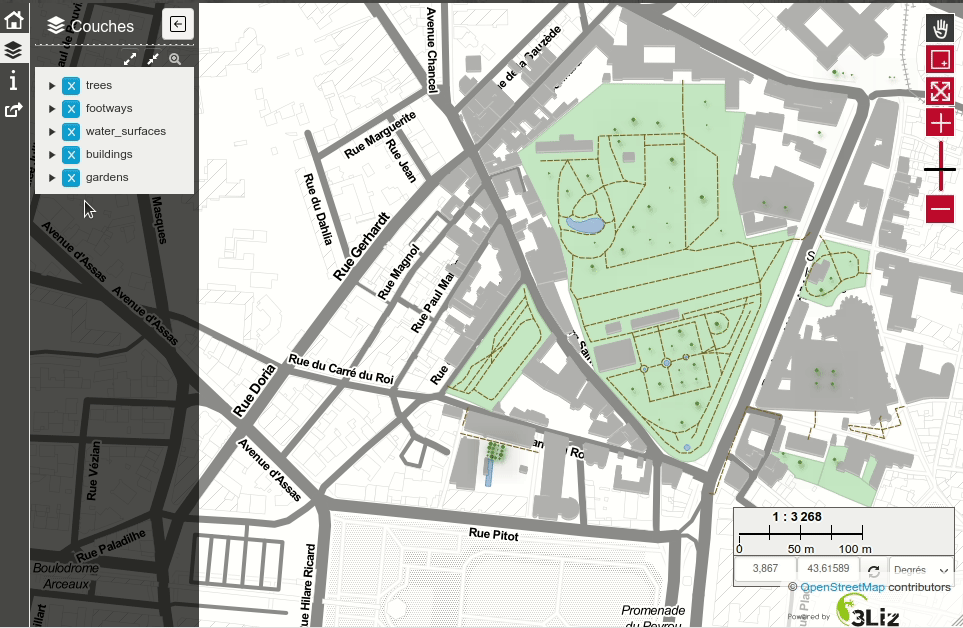

# PgMetadata module for Lizmap Web Client

This project shows how the PgMetadata module can be used to let the user
display the metadata of a Layer in Lizmap Web Client.

The metadata has been created via the [PgMetadata QGIS plugin](https://docs.3liz.org/qgis-pgmetadata-plugin/) and
can be visualized by clicking on the layer title in Lizmap layer tree:
a new tab is then displayed in the layer detail panel.

